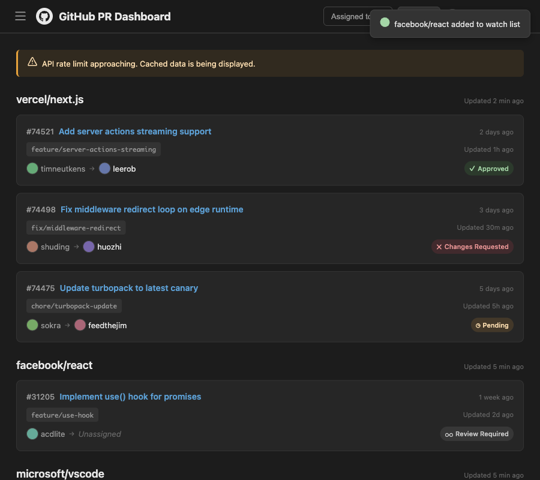
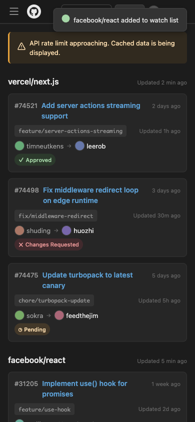

# GitHub PR Dashboard

A local single-user PR monitoring dashboard for GitHub. Watch multiple repositories' open PRs at a glance.

> WARNING: This tool is for **local single-user use only**. Do not expose to the public internet or shared networks.

---

## このツールについて

GitHub PR Dashboard は、複数の GitHub リポジトリにまたがる Open な Pull Request を一画面で把握するためのローカル専用ダッシュボードです。
Docker Compose で `docker compose up` するだけで起動でき、ブラウザから設定・操作のすべてを完結できます。

レビュー待ち / アサイン状況 / 未解決コメントなどを横断的に追えるため、「自分のレビュー漏れを防ぎたい」「チームの PR 状況を素早く確認したい」といった用途に向いています。

## 重要な警告

このツールは **ローカル環境で単独ユーザーが利用すること** を前提に設計されています。

- インターネット / 社内ネットワークに公開しないでください
- 共有マシンで複数ユーザーが利用する用途は想定していません
- GitHub access token はブラウザの **localStorage に平文保存** されます (バックエンドはディスク永続化しません)
- バックエンドは `X-GitHub-Token` ヘッダの存在チェックのみで、token の正当性検証は GitHub 側に委ねています
- フロントエンドは `127.0.0.1` への公開のみを想定しています

公開や共有用途に使うと、GitHub アカウントの乗っ取りや情報漏洩のリスクがあります。
詳細は [SECURITY.md](./SECURITY.md) を参照してください。

## 主な機能

- Open PR をリポジトリ別にカード表示 (4 列グリッド、パステル配色)
- ステータス別のカード色分け (Approved / Changes Requested / Pending / Review Required)
- Reviewed / Re-review タグの表示
- CI ステータスバッジ、コンフリクト警告、behind by N の表示
- 古い PR の警告 (7 日 / 14 日経過で段階的に強調)
- 詳細ペイン: 変更ファイル、未解決コメント、AI 要約 (claude / codex / gemini CLI)
- ブラウザ通知 (新規 PR 検知 / ステータス変更検知)
- PR タイトル・ブランチ・作成者で検索
- リポジトリ表示 ON/OFF (localStorage に永続化)
- レスポンシブ対応 + 4K 解像度向けスケーリング

## スクリーンショット

|                                               |                                            |
| --------------------------------------------- | ------------------------------------------ |
|  |        |
| デスクトップ (1440px)                         | 初回セットアップ画面                       |
|     |  |
| タブレット (900px)                            | モバイル (390px)                           |

## アーキテクチャ

```
┌─────────────────────────────────────────────────────────┐
│ Docker Compose                                          │
│                                                         │
│  ┌──────────────┐       ┌───────────────────────────┐   │
│  │   frontend   │       │         backend           │   │
│  │   (nginx)    │──────→│      (Node.js/Express)    │   │
│  │  127.0.0.1   │       │   :3001  (internal only)  │   │
│  │  :3000 → :80 │       └──────────┬────────────────┘   │
│  └──────────────┘                  │                    │
│                              ┌─────▼─────┐              │
│                              │ data vol  │              │
│                              │config.json│              │
│                              └───────────┘              │
└────────────────────────────────────┬────────────────────┘
                                     │ GitHub GraphQL/REST
                                     ▼
                             ┌───────────────┐
                             │  GitHub API   │
                             │ api.github.com│
                             └───────────────┘

       (任意)
       ┌────────────────┐
       │  ai-server     │ ← backend からホスト経由で呼び出し
       │  (Node.js)     │   (claude / codex / gemini など)
       │ 127.0.0.1:3002 │
       └────────────────┘
```

| サービス         | 役割                                        | ポート              | ベースイメージ     |
| ---------------- | ------------------------------------------- | ------------------- | ------------------ |
| frontend         | 静的ファイル配信 (HTML/CSS/JS)              | 127.0.0.1:3000 → 80 | nginx:alpine       |
| backend          | REST API, GitHub API 呼び出し, データ永続化 | 3001 (内部のみ)     | node:20-alpine     |
| ai-server (任意) | ホスト上の AI CLI を呼び出して要約を返す    | 127.0.0.1:3002      | ホスト Node.js 20+ |

詳細な設計は [docs/design.md](./docs/design.md) を参照してください。

## 必要要件

- Docker Desktop (Compose v2 以降)
- Node.js 20 以上 (AI 要約サーバーをホストで動かす場合のみ)
- GitHub Personal Access Token (`repo` または `public_repo`、必要に応じて `read:org`)

## セットアップ手順

### 1. リポジトリを取得

```bash
git clone https://github.com/Atsumi3/github-pr-dashboard.git
cd github-pr-dashboard
```

### 2. 環境変数ファイルを準備

```bash
cp .env.example .env
```

AI 要約機能を使わない場合は `.env` を空のままで構いません。

### 3. PAT を生成

1. GitHub Settings → Developer settings → Personal access tokens (classic)
2. 用途に応じてスコープを付与
   - private リポジトリも対象に含める場合: `repo`
   - public リポジトリのみで使う場合: `public_repo`
   - 組織の PR (assignee/reviewer 候補に組織メンバーを含める) も拾う場合は `read:org` を併用
3. 表示された token をコピーしてセットアップ画面に貼り付ける

> 注意: token はブラウザの localStorage に平文で保存され、`X-GitHub-Token` ヘッダとして API リクエストに付与されます。XSS / 拡張機能経由で漏洩しうる点に留意してください。バックエンドは token をディスクに永続化しません。

### 4. 起動

```bash
docker compose up --build
```

ブラウザで http://127.0.0.1:3000 を開き、画面の指示に従ってください。

### 5. AI 要約サーバーを使う場合 (任意)

PR 概要やレビューコメントを LLM で要約する機能を使う場合、ホスト上で AI 要約サーバーを別途起動します。
バックエンドコンテナとは共有シークレット (`AI_SHARED_SECRET`) で認証します。

まず安全なシークレットを生成し、`.env` に記入します。

```bash
openssl rand -hex 32
# 例: 4f9c... のような 64 文字の hex 文字列が出力される
```

`.env` の `AI_SHARED_SECRET` と、ai-server 起動時の環境変数の両方に同じ値を入れてください。値が一致しないと AI 要約 API は 401 を返します。空のまま起動すると ai-server は警告ログを出した上で全リクエストを通過させます (本番では絶対に空にしないでください)。

```bash
cd ai-server
AI_SHARED_SECRET=<生成した値> node server.js
```

デフォルトでは `claude` CLI を呼び出します。別の CLI を使うときは環境変数で指定します。

```bash
AI_SHARED_SECRET=<生成した値> AI_CLI=codex node server.js
AI_SHARED_SECRET=<生成した値> AI_CLI=gemini node server.js
```

詳細は [ai-server/README.md](./ai-server/README.md) を参照してください。

## 環境変数

`.env` で設定する値は以下のとおりです。AI 要約機能を使わない場合は空のままで構いません。

| 変数               | 必須              | 説明                                                |
| ------------------ | ----------------- | --------------------------------------------------- |
| `AI_SHARED_SECRET` | AI 要約を使う場合 | バックエンドと ai-server で共有する認証シークレット |

ファイル配置で必要なもの:

| パス               | 必須     | 説明                                                              |
| ------------------ | -------- | ----------------------------------------------------------------- |
| `data/config.json` | 自動生成 | 監視リポジトリ・ポーリング間隔などの永続化先 (token は含まれない) |

ai-server の環境変数:

| 変数               | デフォルト | 説明                                                                     |
| ------------------ | ---------- | ------------------------------------------------------------------------ |
| `PORT`             | 3002       | リスンするポート                                                         |
| `AI_CLI`           | claude     | 実行する CLI コマンド名                                                  |
| `AI_CLI_ARGS`      | (空)       | CLI に渡す追加引数 (スペース区切り)                                      |
| `AI_TIMEOUT_MS`    | 60000      | CLI 実行のタイムアウト (ミリ秒)                                          |
| `AI_SHARED_SECRET` | (空)       | バックエンドとの共有シークレット (`docker-compose.yml` の値と一致させる) |

## ディレクトリ構成

```
.
├── ai-server/        AI 要約サーバー (ホストで実行)
├── backend/          Node.js / Express API サーバー
├── frontend/         nginx 配信の静的フロントエンド
├── data/             永続化データ (gitignore)
├── docs/             設計仕様書 / 要求仕様書 / スクリーンショット
└── docker-compose.yml
```

## トラブルシューティング

| 症状                              | 対処                                                                                                                            |
| --------------------------------- | ------------------------------------------------------------------------------------------------------------------------------- |
| 401 が返り続ける                  | localStorage の token が失効している可能性。セットアップ画面に戻り PAT を再入力                                                 |
| GitHub API が rate limit に達する | 設定画面でポーリング間隔を長くする、または余計な監視リポジトリを Pause                                                          |
| AI 要約が動かない                 | ai-server を起動しているか、`AI_SHARED_SECRET` がバックエンドと一致しているか、`AI_CLI` で指定した CLI がパスに通っているか確認 |
| ポート 3000 が使えない            | `docker compose down` 後に `docker-compose.override.yml` を作成し `frontend.ports` を `127.0.0.1:3100:80` などに上書き          |

## ライセンス

[MIT License](./LICENSE)

## コントリビュート

Issue / Pull Request を歓迎します。詳細は [CONTRIBUTING.md](./CONTRIBUTING.md) を参照してください。

セキュリティ上の問題は公開 Issue ではなく [SECURITY.md](./SECURITY.md) の手順に従って報告してください。
