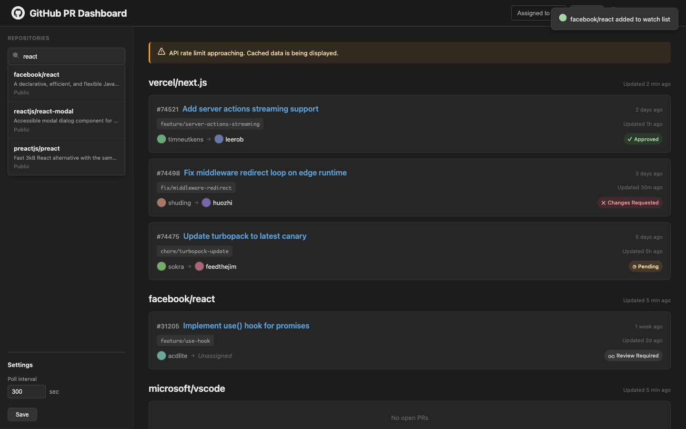
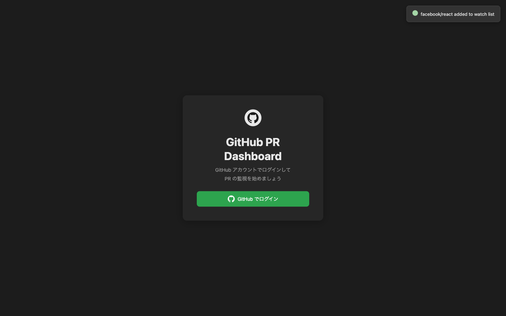

# GitHub PR Dashboard

[](https://github.com/Atsumi3/github-pr-dashboard/actions/workflows/lint.yml)
[](./LICENSE)

複数の GitHub リポジトリにまたがる Open PR を一画面で監視するための、ローカル単独利用向けダッシュボード。`docker compose up` だけで起動できる。

> **このツールは `127.0.0.1` でのローカル単独利用専用。** インターネット / 共有ネットワークに公開しないでください。GitHub access token をブラウザの localStorage に平文保存します。

|                                               |                                      |
| --------------------------------------------- | ------------------------------------ |
|  |  |
| デスクトップ (1440px)                         | 初回セットアップ画面                 |

## 主な機能

- リポジトリ別の Open PR カード表示、レビュー状態 (Approved / Changes Requested / Pending / Review Required) で色分け
- 詳細ペイン: 変更ファイル / 失敗 CI チェック (Actions ログへリンク) / 未解決コメント / AI 要約 (claude / codex / gemini / chatgpt CLI)
- フォアグラウンド (ユーザー設定間隔) + バックグラウンド (5 分) ポーリング、ブラウザ通知
- 目アイコンひとつで「表示 + 更新」を atomic に切替 (停止中は GitHub API 呼び出しゼロ)
- `assignee=me` 経路は GitHub GraphQL search で server-side filter
- 3 層キャッシュ (backend / Service Worker 15 分 / localStorage) でハードリロード後も即時再描画

## クイックスタート

```bash
git clone https://github.com/Atsumi3/github-pr-dashboard.git
cd github-pr-dashboard
cp .env.example .env                  # AI 要約を使う場合は AI_SHARED_SECRET に値を入れる
docker compose up --build
```

ブラウザで http://127.0.0.1:3000 を開き、案内に沿って GitHub Personal Access Token を入力。

### PAT スコープ

| 用途                     | スコープ          |
| ------------------------ | ----------------- |
| private リポジトリも対象 | `repo`            |
| public リポジトリのみ    | `public_repo`     |
| 組織メンバーの PR を拾う | 上記 + `read:org` |

> Token はブラウザの localStorage に平文で保存されます。Fine-grained PAT + 必要最小スコープでの運用を推奨します。

### AI 要約 (任意)

ホストで `claude` / `codex` / `gemini` / `chatgpt` のいずれかの CLI を別途起動。詳細は [ai-server/README.md](./ai-server/README.md) を参照。

```bash
openssl rand -hex 32 > .env  # AI_SHARED_SECRET を生成して .env に追記
cd ai-server
AI_SHARED_SECRET=<.env と同じ値> node server.js
```

> `AI_SHARED_SECRET` 未設定だと ai-server は起動を拒否します (`AI_REQUIRE_SECRET=0` でバイパス可、ただし全リクエストに `[INSECURE]` ログ警告)。

## 必要要件

- Docker Desktop (Compose v2 以降)
- (任意) Node.js 20+ / pnpm 9.15.5 — ai-server をホストで動かす場合 / 開発時の lint・format 用

## アーキテクチャ

3 サービス構成。

| サービス  | 起動先         | ポート            | 役割                                                      |
| --------- | -------------- | ----------------- | --------------------------------------------------------- |
| frontend  | Docker (nginx) | `127.0.0.1:3000`  | 静的配信 + Service Worker、`/api/*` は backend へプロキシ |
| backend   | Docker (Node)  | `3001` (内部のみ) | REST API、GitHub GraphQL/REST 呼び出し、データ永続化      |
| ai-server | ホスト (Node)  | `127.0.0.1:3002`  | (任意) ホスト上の LLM CLI を spawn して要約を返す         |

詳細は [docs/design.md](./docs/design.md) を参照。

## 主要な環境変数

| 変数                | 用途                                                                |
| ------------------- | ------------------------------------------------------------------- |
| `AI_SHARED_SECRET`  | backend と ai-server の共有シークレット (AI 要約使用時必須)         |
| `ALLOWED_ORIGINS`   | backend の Origin / Referer ガード許可リスト (デフォルト localhost) |
| `AI_REQUIRE_SECRET` | ai-server で `0` を設定すると未認証起動を許可 (非推奨)              |

ai-server 側は `AI_CLI` (claude/codex/gemini/chatgpt の whitelist) / `AI_TIMEOUT_MS` / `AI_CONFIG_PATH` も追加で受け付けます。詳細は [ai-server/README.md](./ai-server/README.md)。

## セキュリティ

- backend: Origin/Referer ガード、token 切替検知時の自動キャッシュクリア、エラーメッセージのサニタイズ
- ai-server: shared secret 必須、Host whitelist (DNS rebinding 緩和)、CLI whitelist
- AI 要約は LLM disclaimer を常時表示、間接プロンプトインジェクションは USER_DATA フェンス + システムプロンプトで多層緩和
- CSP: `script-src 'self'` 厳格化 (`style-src 'unsafe-inline'` は動的色のため残存)
- 詳細・脆弱性報告 → [SECURITY.md](./SECURITY.md)

## ディレクトリ構成

```
ai-server/        ホストで動く AI 要約サーバー
backend/          Node.js / Express API
frontend/         nginx で配信する静的フロントエンド
data/             永続化データ (gitignore)
docs/             設計仕様書
docker-compose.yml
```

## ライセンス

[MIT License](./LICENSE)

## コントリビュート

[CONTRIBUTING.md](./CONTRIBUTING.md) を参照。脆弱性報告は [SECURITY.md](./SECURITY.md) の手順に従ってください。
